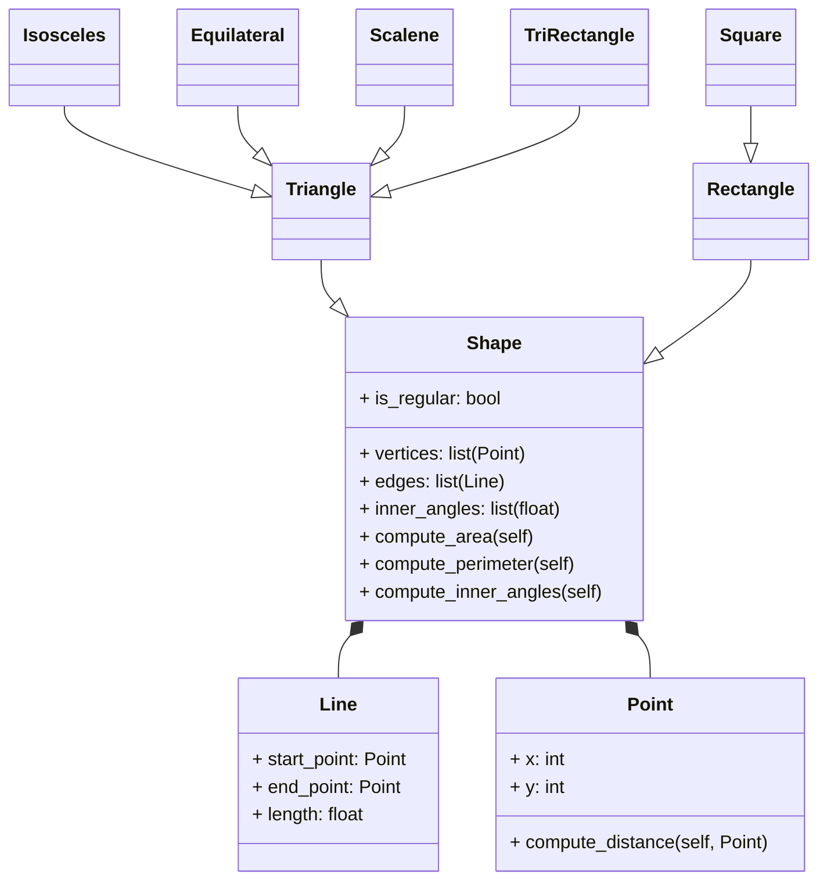
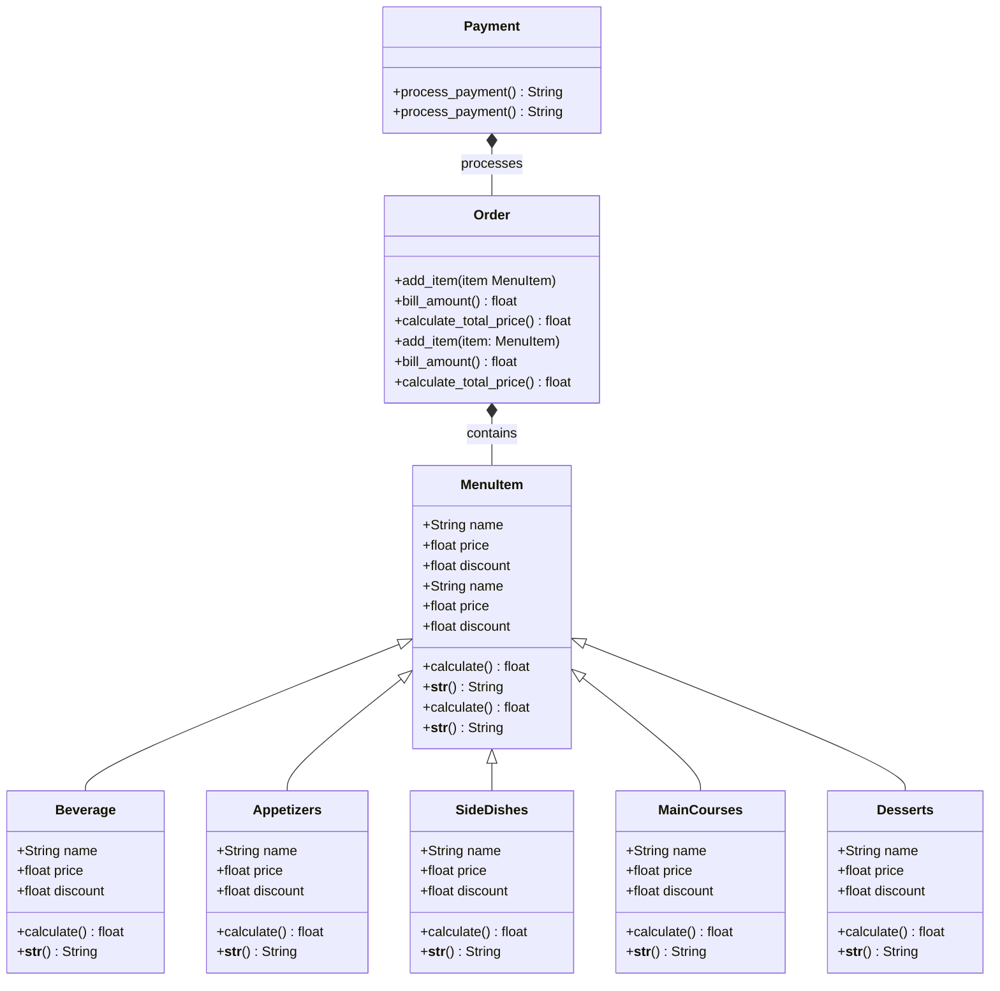

## Estudiante: `Santiago Gamboa Martínez`

### Ejercicio 1:

Descripción - Ejercicio de la Clase

1. Create a superclass called `Shape()`, which is the base of the classes `Reactangle()` and `Square()`, define the methods compute*area and compute_perimeter in `Shape()` and then using polymorphism redefine the methods properly in \_Rectangle* and in _Square_.

2. Using the classes `Point()` and `Line()` define a new super-class `Shape()` with the following structure:

### Diagrama UML:

Use Inheritance, Composition, Encapsulation and Polymorphism to define the classes. All attributes must have their respective setters and getters.

---

## Explicación del Código

1. **Clase `Point` (Punto):**

   - Representa un punto en un plano bidimensional con dos coordenadas, `x` y `y`.
   - Se incluyen métodos para obtener y modificar estos valores mediante los métodos _getter_ y _setter_, que controlan el acceso a las coordenadas.
   - Además, tiene un método para calcular la distancia entre dos puntos utilizando la fórmula de la distancia euclidiana.

2. **Clase `Line` (Línea):**

   - Representa una línea en el plano definida por dos puntos, `start` (inicio) y `end` (fin).
   - La longitud de la línea se calcula utilizando el método `compute_length`, que llama a la función `compute_distance` de la clase `Point` para determinar la distancia entre los dos puntos que definen la línea.
   - También permite modificar los puntos de inicio y fin, y recalcula la longitud de la línea cuando estos cambian.

3. **Clase `Shape` (Figura):**

   - Es una clase base abstracta para todas las figuras geométricas. Define métodos que deben ser implementados por las clases hijas, como `vertices`, `edges`, `inner_angles`, `compute_area`, `compute_perimeter` y `is_regular`.
   - El método `is_regular` se deja para que cada clase hija lo implemente según sus características específicas, como en el caso de los rectángulos o triángulos regulares.

4. **Clase `Rectangle` (Rectángulo):**

   - Representa un rectángulo en un plano bidimensional.
   - El rectángulo puede ser inicializado de diferentes maneras: especificando la esquina inferior izquierda y el ancho y alto; el centro y el ancho y alto; o las dos esquinas opuestas.
   - Implementa los métodos para obtener los vértices, las aristas (líneas), los ángulos internos (siempre 90° para un rectángulo), el área y el perímetro.
   - Además, determina si el rectángulo es regular (es decir, si sus lados son iguales, lo que lo convertiría en un cuadrado).

5. **Clase `Square` (Cuadrado):**

   - Hereda de `Rectangle`, ya que un cuadrado es un caso especial de rectángulo donde los lados son iguales.
   - El constructor toma la esquina inferior izquierda y el largo del lado, y pasa estos valores al constructor de `Rectangle`.
   - Sobrescribe el método `compute_area` para calcular el área de un cuadrado y ajusta la salida del método `__str__` para mostrar "Cuadrado" en lugar de "Rectángulo".

6. **Clase `Triangle` (Triángulo):**

   - Representa un triángulo definido por tres vértices (`v1`, `v2` y `v3`).
   - Implementa un método para verificar si los tres puntos forman un triángulo válido utilizando la regla de los triángulos: la suma de las longitudes de cualquier par de lados debe ser mayor que la longitud del tercer lado.
   - La clase también permite acceder y modificar los vértices del triángulo.

7. **Clase `RightTriangle` (Triángulo Rectángulo):**

   - Hereda de la clase `Triangle` y representa un triángulo rectángulo, que es un tipo especial de triángulo donde uno de los ángulos es de 90 grados.
   - El constructor toma tres vértices como parámetros, pero el triángulo debe cumplir con la condición de ser un triángulo rectángulo, lo que significa que uno de sus ángulos debe ser de 90 grados.
   - Para determinar si el triángulo es rectángulo, la clase implementa un método `is_right_triangle`, que usa el teorema de Pitágoras. Este teorema establece que en un triángulo rectángulo, el cuadrado de la hipotenusa es igual a la suma de los cuadrados de los otros dos lados. Si esta condición se cumple, el triángulo es rectángulo.
   - Además, tiene un método para calcular el área y el perímetro específico de un triángulo rectángulo.

8. **Clase `EquilateralTriangle` (Triángulo Equilátero):**

   - Hereda también de `Triangle` y representa un triángulo equilátero, donde todos sus lados son iguales y todos sus ángulos son de 60 grados.
   - El constructor de esta clase toma un solo parámetro para el lado del triángulo, ya que, en un triángulo equilátero, todos los lados tienen la misma longitud.
   - Implementa un método para calcular el área de un triángulo equilátero utilizando la fórmula estándar para este tipo de triángulo.
   - También sobrescribe el método `is_regular` para devolver `True`, ya que un triángulo equilátero siempre es regular (tiene lados y ángulos iguales).

9. **Clase `ScaleneTriangle` (Triángulo Escaleno):**

   - Hereda de la clase `Triangle` y representa un triángulo escaleno, en el cual todos sus lados tienen longitudes diferentes y, por lo tanto, también sus ángulos son diferentes.
   - El constructor recibe tres vértices como parámetros y calcula la longitud de cada lado utilizando la distancia entre los puntos.
   - Implementa un método para verificar si un triángulo es escaleno, comprobando si las longitudes de los tres lados son diferentes. Si las longitudes de los tres lados son distintas, el triángulo es escaleno.
   - Además, sobrescribe el método `is_regular` para devolver `False`, ya que un triángulo escaleno nunca será regular.

10. **Clase `IsoscelesTriangle` (Triángulo Isósceles):**

- Hereda de la clase `Triangle` y representa un triángulo isósceles, que tiene al menos dos lados de igual longitud.
- Al igual que las otras clases, el constructor recibe tres vértices como parámetros, y calcula la longitud de los lados.
- La clase implementa un método para verificar si el triángulo es isósceles, comprobando si al menos dos de sus lados tienen la misma longitud.
- También sobrescribe el método `is_regular` para devolver `False` en este caso, ya que, aunque tiene dos lados iguales, no tiene todos los lados iguales como un triángulo equilátero.

---

The restaurant revisted

- Add setters and getters to all subclasses for menu item.

- Override calculate_total_price() according to the order composition (e.g if the order includes a main course apply some disccount on beverages).

- Add the class Payment() following the class example.

## Detalles del Código

**Funcionalidad del Código**:

**_Este código define un sistema básico para gestionar un menú de restaurante, hacer pedidos y procesar pagos._**

---

### **1. Clase `MenuItem`**

_La clase base se llama `MenuItem`. Básicamente, esta es la estructura principal de cualquier artículo del menú, ya sea una bebida, un plato fuerte o un postre. Cada artículo tiene tres atributos principales: el nombre, el precio y un descuento opcional. Además, tiene validaciones para asegurarse de que los valores sean válidos, como que el precio sea positivo y el descuento esté entre 0 y 1._

- _**Por ejemplo, si creamos un artículo llamado 'Coca Cola' con un precio de $2.50 y un descuento del 20%, la clase calcula automáticamente el precio con descuento. También tiene métodos llamados 'getters' y 'setters' que nos permiten obtener o cambiar esos valores de manera controlada.**_

- _**Además, hay un método `**str**` que define cómo se ve la información del artículo cuando se imprime. Esto es útil para mostrar el menú o un resumen del pedido.**_

---

### **2. Subclases de `MenuItem`**

_Luego tenemos subclases como `Beverage`, `Appetizers`, `SideDishes`, `MainCourses` y `Desserts`. Estas subclases heredan de `MenuItem` y representan categorías específicas del menú._

---

### **3. Clase `Order`**

_Después viene la clase `Order`, que gestiona todo el pedido del cliente. Es como una canasta donde se guardan los artículos seleccionados. Tiene un método llamado `add_item` para agregar cosas al pedido, y otros métodos para calcular el precio total._

- **_Un detalle interesante aquí es que si el pedido incluye un plato principal, se aplica un descuento adicional del 10% a las bebidas. Este tipo de reglas de negocio están encapsuladas en el método `calculate_total_price`._**

---

### **4. Clase `Payment`**

_Cuando ya tienes el pedido listo, la clase `Payment` se encarga de procesar el pago. Puedes elegir entre pagar en efectivo o con tarjeta, y el método `process_payment` calcula el total y confirma que el pago se ha realizado._

- **_Por ejemplo, si el pedido total es de $20.50, la clase imprime algo como: 'Pago de $20.50 procesando usando tarjeta'._**

---

### **5. Menú y Ejemplo Práctico**

_Finalmente, tenemos una lista que actúa como nuestro menú. Cada artículo es una instancia de las clases que mencionamos antes, como `Beverage` o `MainCourses`. Esto nos permite crear pedidos personalizados para los clientes._

- **_En el ejemplo, se crea un pedido con una bebida, un aperitivo, un acompañamiento, un plato principal y un postre. Luego se imprimen todos los artículos, el total sin descuentos adicionales y el total con los descuentos aplicados._**

---

### Diagrama UML

